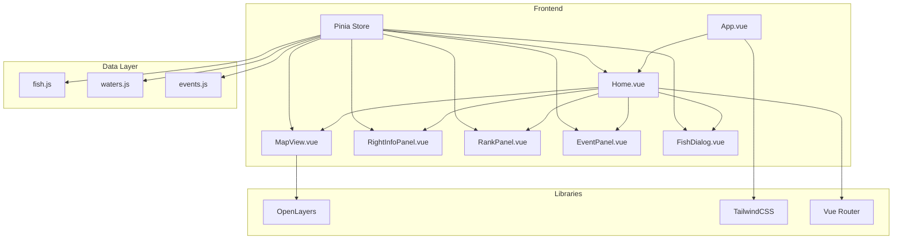

## 1. Architecture Design



## 2. Technology Description

- **Frontend**: Vue3 + Vite + JavaScript + TailwindCSS + OpenLayers + Pinia
- **Initialization Tool**: vite-init
- **Backend**: 无（第一阶段使用Mock数据）
- **Database**: 无（第一阶段）

## 3. Route Definitions

| Route | Purpose |
|-------|---------|
| / | 首页 |

## 4. Data Model

### 4.1 项目目录结构

```text
src/
├── assets/
├── components/
│   ├── map/
│   │    ├── MapView.vue
│   ├── panels/
│   │    ├── RightInfoPanel.vue
│   │    ├── RankPanel.vue
│   │    ├── EventPanel.vue
│   ├── dialogs/
│   │    ├── FishDialog.vue
│   ├── effects/
│   │    ├── ReleaseAnimation.vue
├── data/
│   ├── fish.js
│   ├── waters.js
│   ├── events.js
├── store/
│   ├── app.js
├── views/
│   ├── Home.vue
├── router/
│   ├── index.js
├── App.vue
├── main.js
```

### 4.2 数据定义

#### 鱼类数据
```javascript
export const fishes = [
  {
    id: 1,
    name: '东北大鲤鱼',
    rarity: '普通',
    merit: 1,
    emoji: '🐟'
  },
  {
    id: 2,
    name: '程序员草鱼',
    rarity: '稀有',
    merit: 2,
    emoji: '🐠'
  },
  {
    id: 3,
    name: '摸鱼专家',
    rarity: '稀有',
    merit: 2,
    emoji: '🐡'
  },
  {
    id: 4,
    name: '深海摸黑鱼',
    rarity: '史诗',
    merit: 5,
    emoji: '🐋'
  }
]
```

#### 水域数据
```javascript
export const waters = [
  {
    id: 1,
    name: '长江',
    releaseCount: 986000,
    ecologyScore: 72,
    position: [114.3, 30.5]
  },
  {
    id: 2,
    name: '黄河',
    releaseCount: 237000,
    ecologyScore: 65,
    position: [114.6, 37.8]
  },
  {
    id: 3,
    name: '珠江',
    releaseCount: 562000,
    ecologyScore: 81,
    position: [113.2, 23.1]
  }
]
```

#### 事件数据
```javascript
export const events = [
  {
    time: '12:00',
    content: '长江发现大量程序员草鱼，正在努力写代码...',
    tag: '事件'
  },
  {
    time: '11:45',
    content: '珠江水域生态环境改善，鱼类数量增加20%',
    tag: '生态'
  }
]
```

### 4.3 Pinia Store 结构

```javascript
export const useAppStore = defineStore('app', {
  state: () => ({
    selectedWater: null,
    userMerit: 114514,
    userLevel: 'Lv.9',
    userTitle: '赛博龙王',
    onlineCount: 8899,
    waters: [],
    fishes: [],
    broadcastList: [],
    rankList: [],
    eventsList: [],
    showFishDialog: false
  }),
  actions: {
    selectWater(water) {
      this.selectedWater = water
    },
    releaseFish(fish, count) {
      // 放生逻辑
    },
    addMerit(value) {
      this.userMerit += value
    },
    toggleFishDialog(show) {
      this.showFishDialog = show
    }
  }
})
```

## 5. 技术规范

- 使用 Vue3 Composition API
- 使用 `&lt;script setup&gt;` 语法
- 不使用 TypeScript
- 使用 TailwindCSS 实现 UI
- 不使用 Element Plus 或 Ant Design
- 第一阶段使用 Mock 数据，无需真实后端

