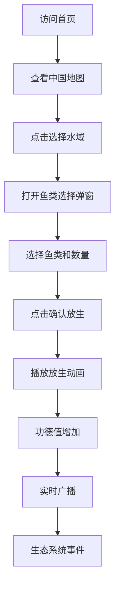

## 1. Product Overview

《赛博放生》是一个基于GIS地图可视化的互联网娱乐项目，用户可以在中国地图上选择水域、选择鱼类进行放生，获得电子功德，体验一本正经但越来越离谱的互联网生态行为艺术。

- 核心目的：提供一个娱乐化、趣味化的虚拟放生体验，让用户通过互动获得轻松愉悦的感受
- 目标用户：互联网年轻用户，喜欢新奇、创意、幽默感的产品体验

## 2. Core Features

### 2.1 User Roles

| Role | Registration Method | Core Permissions |
|------|---------------------|------------------|
| 普通用户 | 无需注册（第一阶段） | 使用全部核心功能，查看生态信息、排行榜、广播 |

### 2.2 Feature Module

1. **首页**: 地图展示、水域选择、鱼类选择、放生动画、生态信息展示
2. **生态信息面板**: 生态指数、鱼类组成、放生统计
3. **功德排行榜**: 用户功德排名展示
4. **实时广播**: 用户放生行为实时播报
5. **生态事件栏**: 展示生态系统演化事件

### 2.3 Page Details

| Page Name | Module Name | Feature description |
|-----------|-------------|---------------------|
| 首页 | 顶部导航栏 | 展示品牌Logo、导航菜单、用户信息 |
| 首页 | 地图区域 | 使用OpenLayers展示中国地图，显示主要水域节点，支持缩放、平移、点击选择 |
| 首页 | 鱼类选择弹窗 | 点击水域后弹出，展示可放生的鱼类列表，支持选择数量 |
| 首页 | 生态信息面板 | 展示当前选中水域的生态指数、鱼类组成、累计放生数量 |
| 首页 | 实时广播 | 滚动展示其他用户的放生行为 |
| 首页 | 生态事件栏 | 展示生态系统产生的随机事件 |
| 首页 | 功德排行榜 | 展示用户功德排名 |

## 3. Core Process

用户访问首页 → 查看地图 → 点击选择水域 → 打开鱼类选择弹窗 → 选择鱼类和数量 → 点击放生按钮 → 播放放生动画 → 功德值增加 → 广播放生行为 → 生态系统产生随机事件

## 4. User Interface Design

### 4.1 Design Style

- **主色调**: 深蓝色 #071018，主蓝 #1677ff，高亮 #00e5ff
- **卡片风格**: 毛玻璃效果（半透明）、蓝色发光边框
- **布局风格**: 大屏可视化布局，卡片化模块
- **设计风格**: 科技GIS风格、政务环保平台风格、深蓝色赛博UI
- **动效**: 渐变、发光、平滑过渡动画

### 4.2 Page Design Overview

| Page Name | Module Name | UI Elements |
|-----------|-------------|-------------|
| 首页 | 顶部导航栏 | 深蓝色背景，发光边框，品牌Logo，导航菜单，用户头像和功德值 |
| 首页 | 地图区域 | OpenLayers地图，蓝色水系效果，水域高亮标记，发光选中标注 |
| 首页 | 鱼类选择弹窗 | 毛玻璃卡片，鱼类列表，数量选择器，确认放生按钮 |
| 首页 | 生态信息面板 | 圆形进度条展示生态指数，百分比展示鱼类组成，数字滚动效果 |
| 首页 | 实时广播 | 滚动列表，用户头像、昵称、放生内容、时间戳 |
| 首页 | 功德排行榜 | 排名列表，前三名特殊样式，用户头像、昵称、功德值 |
| 首页 | 生态事件栏 | 横向滚动事件列表，时间、事件内容、标签 |

### 4.3 Responsiveness

- 桌面优先，大屏展示优化
- 支持响应式布局适配不同屏幕尺寸
- 触摸交互优化

